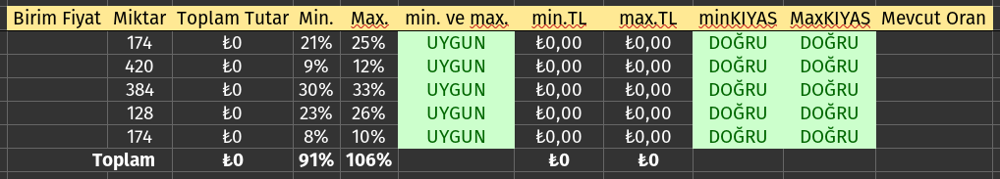
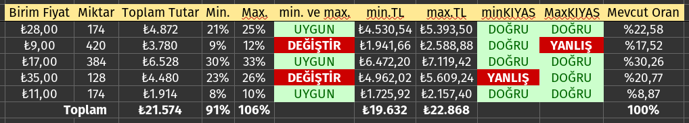
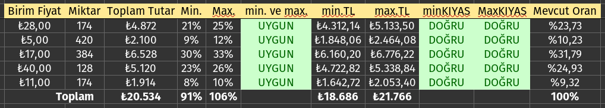

# Puanli_BirimFiyat
Birim Fiyat Teklif Usulü Yapılan İhalelerde, Puanlama Sistemine uygun birim fiyat belirlemeye dair kod çalışması.
Her bir poz için, İdarece belirlenen oranlara uygun teklif birim fiyat tespit eden python uygulaması.

Aşağıda örnek gösterimden daha kolay anlaşılacağını düşünüyorum.

**Teklif Cetvelinin BOŞ Hali**

**Teklif Cetvelinin Hatalı Doldurulmuş Hali**

**Teklif Cetvelinin Dogru Doldurulmuş Hali**
